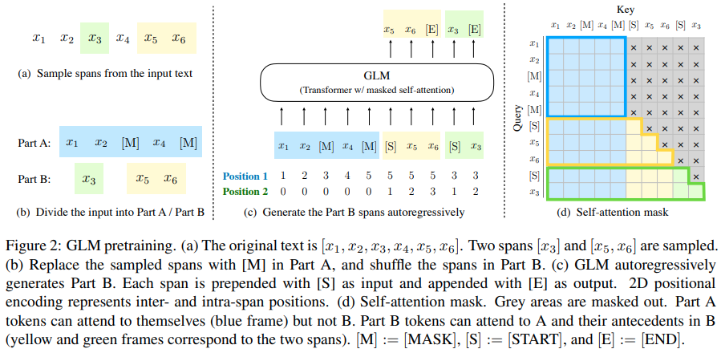

</img>

## Protein GLM (wip)

Implementation of a protein autoregressive language model, but with <a href="https://arxiv.org/abs/2103.10360">autoregressive infilling objective</a> (editing subsequences capability). It will also make use of a super-conditioning technique as outlined <a href="https://github.com/lucidrains/dalle-pytorch#adjust-text-conditioning-strength">here</a>.

The Transformers model will employ every state of the art improvement currently known.

## Citations

```bibtex
@inproceedings{Du2021GLMGL,
  title   = {GLM: General Language Model Pretraining with Autoregressive Blank Infilling},
  author  = {Zhengxiao Du and Yujie Qian and Xiao Liu and Ming Ding and Jiezhong Qiu and Zhilin Yang and Jie Tang},
  year    = {2021}
}
```
